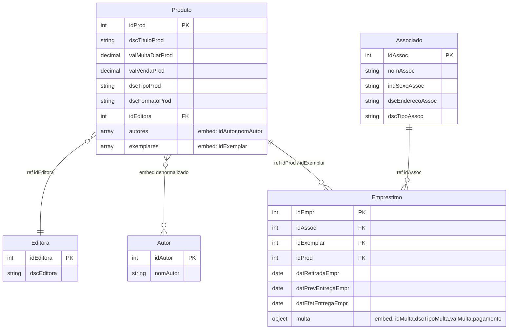

# Modelo Não-Relacional — Sistema de Biblioteca (MongoDB)

Modelagem orientada a documentos para o mesmo domínio descrito em [`../relacional/modelo-relacional.md`](../relacional/modelo-relacional.md), adaptada para uso com **MongoDB + Mongoose** em um backend Express.

## Filosofia da Modelagem

Em modelos relacionais a regra-base é **normalizar** (3FN) e juntar tudo via `JOIN`. Em MongoDB a regra-base é **modelar pelas consultas**: embute o que é lido junto, referencia o que cresce sem limite ou tem ciclo de vida independente. As três perguntas que guiaram cada decisão:

1. Esse dado faz sentido **fora** do documento pai?
2. O dado embutido pode crescer **sem limite** (estouro do limite de 16 MB por documento)?
3. Existem **escritas concorrentes** ao mesmo dado a partir de contextos diferentes?

Quando a resposta para as três é "não", embute. Caso contrário, referencia por id.

## Diagrama de Coleções

> Linhas contínuas com FK ao lado representam **referências por id**.
> Os campos `autores`, `exemplares` e `multa` (com `pagamento` aninhado) são **subdocumentos embutidos** dentro do documento pai.

## Coleções e Decisões de Modelagem

### `editora`

Coleção independente. Editora é referenciada por `Produto` apenas pelo `idEditora` — sem desnormalização do nome, porque o nome da editora muda raramente e não é exibido em listagens de produto na maioria das telas. Quando precisar exibir, faz `populate`.

### `autor`

Coleção independente, mas com **denormalização parcial**: o `nomAutor` é replicado dentro de `produto.autores[]` para evitar `populate` em toda listagem de produto. A coleção `autor` continua existindo como fonte da verdade para edição em massa e para cenários onde se busca todos os produtos de um autor.

### `produto`

Documento agregador do acervo. Contém:

- Atributos próprios do produto (título, valores, tipo, formato).
- `idEditora` — referência simples.
- `autores[]` — array de subdocumentos `{ idAutor, nomAutor }`. **Embutido** porque um produto raramente tem mais de 5–10 autores e essa lista é lida sempre junto com o produto.
- `exemplares[]` — array de subdocumentos `{ idExemplar }`. **Embutido** porque exemplar não existe sem produto, é lido junto, e a quantidade é limitada (acervos físicos não escalam para milhões de cópias do mesmo título).

> **Por que não criar coleção `exemplar` separada?**
> No relacional o exemplar precisa ser tabela porque é referenciado pelo empréstimo. No MongoDB o empréstimo guarda apenas `idExemplar` (chave numérica), e a busca pelo exemplar é feita por `Produto.findOne({ "exemplares.idExemplar": X })`. Evita uma coleção e uma query a cada empréstimo lido.

### `associado`

Coleção independente. Não há nada que valha a pena embutir aqui — o associado vive sozinho, é referenciado por `Emprestimo`, e seus dados (nome, endereço, tipo) são editados independentemente do histórico de empréstimos.

### `emprestimo`

Coleção transacional. Contém:

- Referências por id: `idAssoc`, `idExemplar`, e `idProd` redundante.
- Datas de retirada, previsão e entrega efetiva.
- `multa` — **subdocumento embutido** (não array). Cada empréstimo gera no máximo uma multa por tipo, e multa só existe a partir de um empréstimo. Embutir evita uma coleção separada e uma query.
- `multa.pagamento` — **subdocumento aninhado dentro da multa**. Relação 1:1, ciclo de vida idêntico.

> **Trade-off do `idProd` redundante:**
> O relacional chega no produto via `Emprestimo → Exemplar → Produto`. No documento, sem essa cadeia, exibir uma listagem de empréstimos com o título do produto exigiria duas etapas (acha o produto que contém o exemplar, depois lê o título). Guardar `idProd` direto no empréstimo elimina o passo intermediário ao custo de uma redundância controlada (o vínculo exemplar→produto não muda depois de criado).

> **Decisão sobre múltiplas multas por empréstimo:**
> O relacional permite 1:N (atraso + dano simultâneos). Aqui escolhi `multa` como subdocumento único — o domínio descrito tem dois tipos (`atraso` e `dano_perda`) e o caso simultâneo é raro. Se precisar suportar oficialmente, basta trocar `multa: {}` por `multas: [{}]`.

## Estratégia de Embedding vs Referência

| Relacionamento | Decisão | Justificativa |
|---|---|---|
| Produto — Exemplar | **Embed** array | Exemplar não existe sem produto, lido junto, baixa cardinalidade |
| Produto — Autor | **Embed denormalizado** + coleção | Lido junto, mas autor tem identidade própria |
| Produto — Editora | **Ref** por id | Editora vive sozinha, raramente exibida em massa |
| Associado — Emprestimo | **Ref** por id | Histórico cresce sem limite — embed estouraria documento |
| Exemplar — Emprestimo | **Ref** por id (`idExemplar`) | Mesmo motivo — empréstimos recorrentes do mesmo exemplar |
| Emprestimo — Multa | **Embed** subdocumento | 1:0..1, ciclo de vida atrelado |
| Multa — Pagamento | **Embed** aninhado | 1:1 estrito, ciclo de vida atrelado |

## Padrão de Nomenclatura

Mantido o padrão **Domínio + Qualificador + Entidade** do modelo relacional, com duas adaptações:

1. Qualificadores foram **expandidos** quando a abreviação ficaria ambígua sem o contexto da tabela (`dscTit` → `dscTitulo`, `valMult` → `valMulta`, `datRet` → `datRetirada`). Documentos JSON são lidos sem o cabeçalho `CREATE TABLE`, então a clareza importa mais que a economia de caracteres.
2. Chaves primárias mantêm o prefixo `id` + nome da entidade (`idProd`, `idAssoc`, `idMulta`).

| Atributo no SQL | Atributo no JSON | Observação |
|---|---|---|
| `dscTitProd` | `dscTituloProd` | Qualificador expandido |
| `valMultDiarProd` | `valMultaDiarProd` | Qualificador expandido |
| `valVendProd` | `valVendaProd` | Qualificador expandido |
| `dscFormProd` | `dscFormatoProd` | Qualificador expandido |
| `indSexAssoc` | `indSexoAssoc` | Qualificador expandido |
| `dscEndAssoc` | `dscEnderecoAssoc` | Qualificador expandido |
| `datRetEmpr` | `datRetiradaEmpr` | Qualificador expandido |
| `datPrevEntrEmpr` | `datPrevEntregaEmpr` | Qualificador expandido |
| `datEfetEntrEmpr` | `datEfetEntregaEmpr` | Qualificador expandido |
| `dscFormPagto` | `dscFormaPagto` | Qualificador expandido |

## Trade-offs Aceitos

| Aspecto | Relacional | NoSQL (este modelo) |
|---|---|---|
| Consistência referencial | Garantida pelo SGBD (`FK`) | Responsabilidade da aplicação (Mongoose) |
| Atomicidade multi-documento | `BEGIN/COMMIT` natural | Apenas dentro de um documento (ou via `session` + transação) |
| Atualização de nome de autor | `UPDATE Autor` único | `UPDATE Autor` + propagar para `produto.autores[].nomAutor` |
| Listar empréstimos com título do produto | `JOIN` | Ler `idProd` redundante diretamente do empréstimo |
| Buscar exemplar por id | `SELECT FROM Exemplar` | `Produto.findOne({"exemplares.idExemplar": X})` |
| Crescimento de histórico | `INSERT` ilimitado | `INSERT` na coleção `emprestimo` (referência, não embed) |

A operação **mais cara** que esse modelo aceita é **propagar mudança de nome de autor**. Decidi pagar esse custo (raro) para baratear a leitura de produtos com autores (frequente).

## Regras de Negócio

As mesmas do modelo relacional. O que muda é **onde** cada regra é validada:

| Regra | Onde aplicar |
|---|---|
| 1. Comum: máx. 3 empréstimos ativos | Pre-save hook do Mongoose em `Emprestimo` |
| 2. VIP: empréstimos ilimitados | Mesma validação, ramificando por `dscTipoAssoc` |
| 3. Multa atraso = `dias × valMultaDiarProd` | Camada de serviço ao registrar devolução |
| 4. Nuvem não gera multa | `valMultaDiarProd = 0` no produto, regra 3 zera naturalmente |
| 5. Dano/perda = `valVendaProd` | Camada de serviço ao classificar tipo da multa |
| 6. Desconto em dinheiro | Camada de serviço ao registrar pagamento |
| 7. Formas aceitas | Enum no schema do Mongoose (`dscFormaPagto`) |
| 8. Produtos disponíveis para venda | Sem restrição adicional — `valVendaProd` já existe |

Validações de domínio (`dscTipoProd`, `dscFormaPagto`, `indSexoAssoc`, `dscTipoAssoc`, `dscTipoMulta`) viram `enum` no schema do Mongoose, equivalendo aos `CHECK` do SQL.

## Resumo das Coleções

| Coleção | Documentos independentes | Embeds | Referências |
|---|---|---|---|
| `editora` | sim | — | — |
| `autor` | sim | — | — |
| `produto` | sim | `autores[]`, `exemplares[]` | `idEditora` |
| `associado` | sim | — | — |
| `emprestimo` | sim | `multa` (com `pagamento` aninhado) | `idAssoc`, `idExemplar`, `idProd` |
