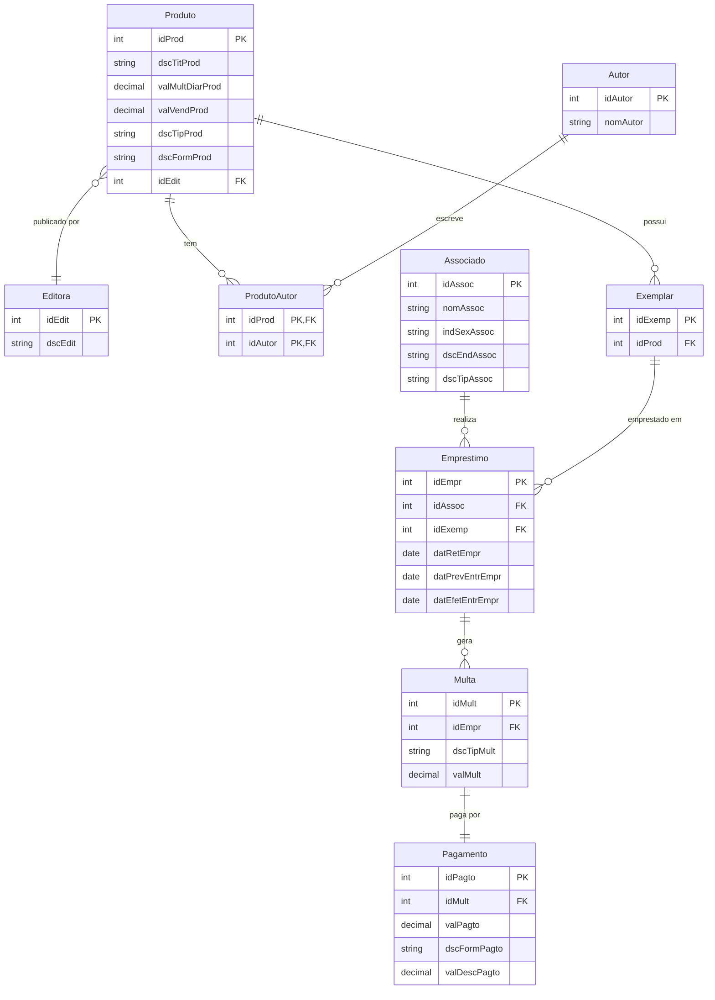

# Diagrama ERM — Sistema de Biblioteca

## Diagrama Entidade-Relacionamento

## Descrição das Entidades

### Produto

Entidade central que representa qualquer item do acervo: livro, CD, DVD, revista, jornal ou arquivo em nuvem. O atributo `dscTipProd` diferencia a categoria. O campo `valMultDiarProd` armazena o valor fixo de multa por dia de atraso (ex: R$1,00 para livro, R$2,00 para CD, R$0,00 para arquivos em nuvem). O campo `valVendProd` serve tanto para venda do produto quanto para cálculo da multa por dano/perda. O campo `dscFormProd` (PDF ou vídeo) é preenchido apenas quando o tipo for arquivo em nuvem, sendo nulo para os demais.

### Autor

Autores dos produtos. Um produto pode ter um ou mais autores, e um autor pode estar associado a vários produtos (relacionamento N:N, resolvido pela tabela associativa `ProdutoAutor`).

### Editora

Cada produto é publicado por uma editora, identificada por um `id` (int). Vários produtos podem pertencer à mesma editora (relacionamento N:1).

### Exemplar

Cópias físicas de cada produto, numeradas sequencialmente (1, 2, 3...). Cada produto possui pelo menos um exemplar. É o exemplar que é efetivamente emprestado, não o produto em si.

### Associado

Usuários cadastrados na biblioteca, com código (`idAssoc`), nome (`nomAssoc`), sexo (`indSexAssoc`) e endereço (`dscEndAssoc`). O atributo `dscTipAssoc` distingue entre associado comum (máximo 3 empréstimos simultâneos) e VIP (empréstimos ilimitados).

### Emprestimo

Registra cada operação de empréstimo com as três datas exigidas: retirada (`datRetEmpr`), previsão de entrega (`datPrevEntrEmpr`) e entrega efetiva (`datEfetEntrEmpr`). Referencia o associado e o exemplar envolvidos.

### Multa

Entidade separada para registrar as multas geradas. O campo `dscTipMult` diferencia entre "atraso" (calculada como dias de atraso × `valMultDiarProd` do produto) e "dano_perda" (valor equivalente ao `valVendProd` do item). Um empréstimo pode gerar mais de uma multa (ex: atraso e dano simultâneos), justificando a cardinalidade 1:N.

### Pagamento

Registra o pagamento de cada multa. O campo `dscFormPagto` aceita: dinheiro, cartão de crédito, cartão de débito, Picpay ou Pix. O campo `valDescPagto` armazena o desconto especial aplicado quando o pagamento é feito em dinheiro.

## Padrão de Nomenclatura dos Atributos

Estrutura: **Domínio Básico + Qualificadores (máx. 2) + Nome da Tabela**.

| Atributo | Domínio | Qualificadores | Tabela | Significado |
|---|---|---|---|---|
| `valMultDiarProd` | val | Mult, Diar | Prod | Valor da multa diária do produto |
| `valVendProd` | val | Vend | Prod | Valor de venda do produto |
| `dscTitProd` | dsc | Tit | Prod | Descrição do título do produto |
| `indSexAssoc` | ind | Sex | Assoc | Indicador de sexo do associado |
| `dscEndAssoc` | dsc | End | Assoc | Descrição do endereço do associado |
| `datPrevEntrEmpr` | dat | Prev, Entr | Empr | Data prevista de entrega do empréstimo |
| `datEfetEntrEmpr` | dat | Efet, Entr | Empr | Data efetiva de entrega do empréstimo |
| `valDescPagto` | val | Desc | Pagto | Valor do desconto do pagamento |

## Cardinalidades

| Relacionamento | Cardinalidade | Descrição |
|---|---|---|
| Produto — Exemplar | 1:N | Um produto possui um ou mais exemplares |
| Produto — Autor | N:N | Um produto pode ter vários autores e vice-versa |
| Produto — Editora | N:1 | Vários produtos pertencem a uma editora |
| Associado — Emprestimo | 1:N | Um associado pode realizar vários empréstimos |
| Exemplar — Emprestimo | 1:N | Um exemplar pode ser emprestado várias vezes |
| Emprestimo — Multa | 1:N | Um empréstimo pode gerar uma ou mais multas |
| Multa — Pagamento | 1:1 | Cada multa possui um pagamento correspondente |

## Regras de Negócio

1. Associados comuns podem ter no máximo 3 empréstimos ativos simultaneamente.
2. Associados VIP não possuem limite de empréstimos.
3. A multa por atraso é calculada como: `qtdDiasAtrasoEmpr × valMultDiarProd`.
4. Arquivos em nuvem não geram multa por atraso (`valMultDiarProd = 0`).
5. Em caso de perda ou dano, o associado paga multa equivalente ao `valVendProd` do item.
6. Pagamentos em dinheiro recebem desconto especial (`valDescPagto`).
7. Formas de pagamento aceitas: dinheiro, cartão de crédito, cartão de débito, Picpay e Pix.
8. Todos os produtos do acervo também estão disponíveis para venda.
